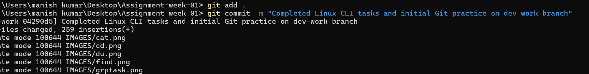
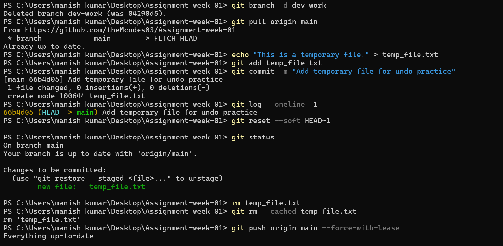
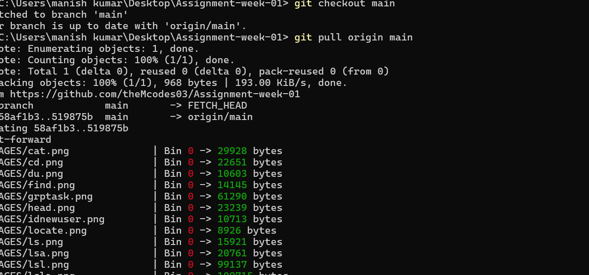
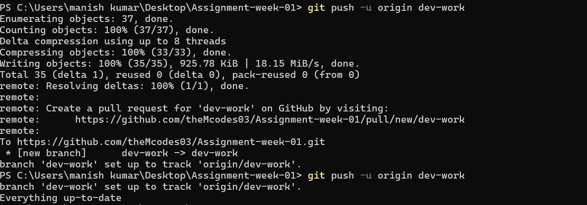

# My Git Learning Journey

## This document explains various Git commands I've learned and practiced.

### 1. git add .

This command adds all files in the current directory and its subdirectories to the staging area.

### 2. git commit

This command saves staged changes to the repository history.

## git commit -m "Completed Linux CLI tasks and initial Git practice on dev-work branch"

### 3. gitbranch 

This command lists all local branches in the current repository. this command allows you to list, create, or delete branches. Branches let you work on new features or fixes without affecting the main project line.

### 4. git pull

This command downloads the latest content from a remote repository and merges it into the current branch or better words This command is used to fetch changes from a remote repository and integrate (merge) them into your current local branch. It's how you get updates from others.

### 5. git push

This command uploads local repository content to a remote repository. This command is used to push changes from your local repository to a remote repository. It's how you share your updates with others.

