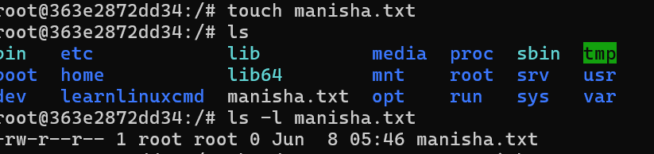
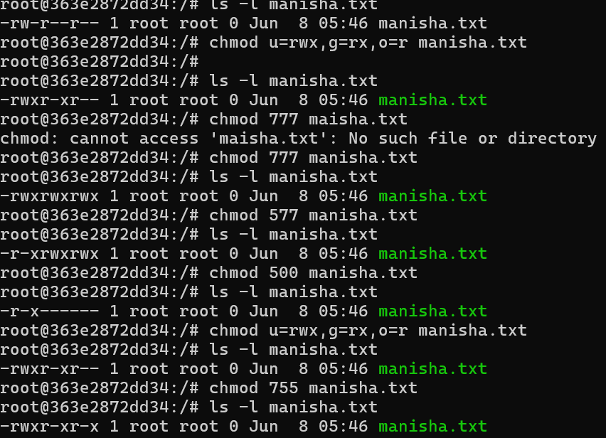

# Task 1: Basic File and Directory Navigation

## Description

In this task I focused on familiarizing myself with fundamental Linux commands for navigating the file system and listing directory contents. These commands are essential for understanding where you are and what files are available.

## Commands Used

1. touch

### Create the File using touch

touch manisha.txt

2. ls 

    ## Purpose/Explanation:

## The ls command lists the contents of a directory.    I used it to see files and subdirectories.

3. ls -l

## I also used ls -l which provides a "long list" format, showing detailed information like file permissions, owner, group, size, and last modification date. This helped me understand file attributes at a glance.

4. chmod
## Change the permissions of a file or directory, I used chmod to change the permissions of a file. For example, I changed the permissions of a file called "manisha.txt" to make it executable.
 