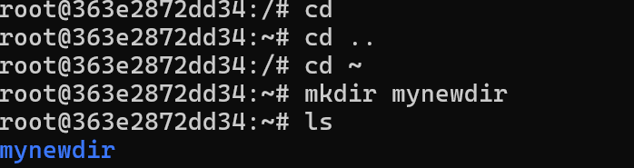
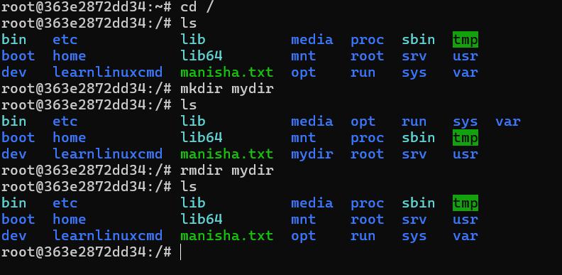
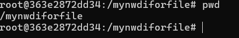
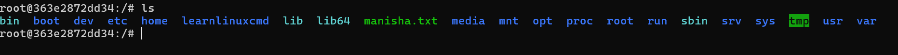
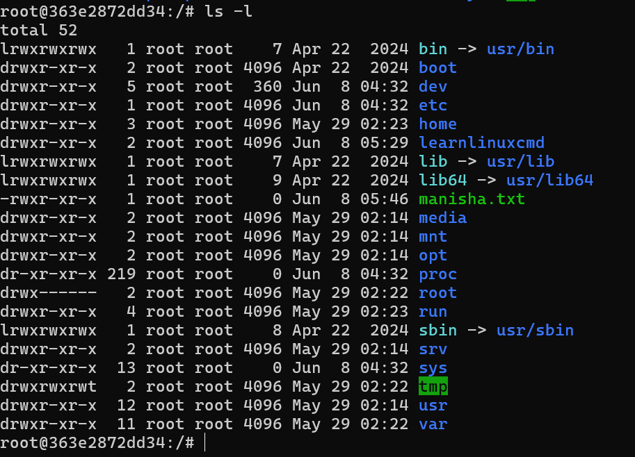
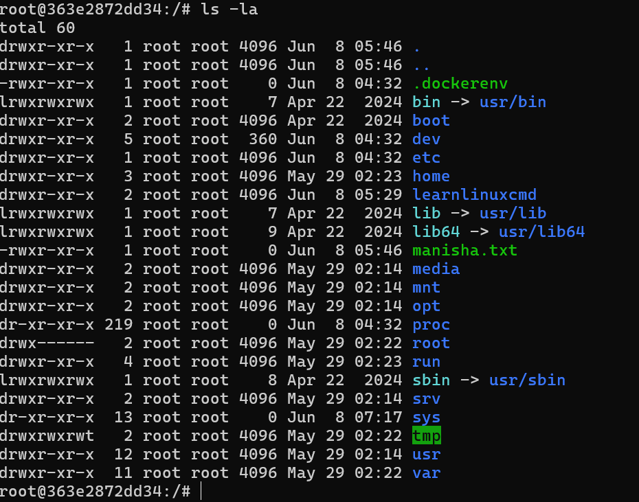
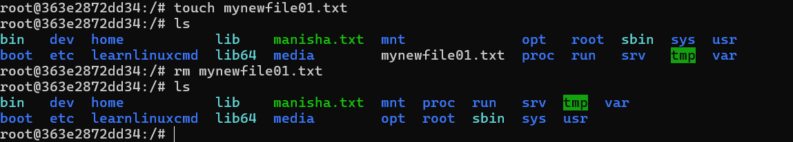
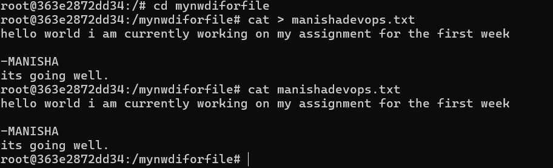

# Task 2

1. cd 
 # change directory

## I used cd to navigate to different directories. For example, to go to the home directory, I used cd ~. To go to the parent directory, I used cd .. to move up one level in the directory hierarchy.

cd /
pwd # To confirm

cd ~/usergrop3
pwd # To confirm

cd ..
pwd # To confirm

2. mkdir

## Create a new directory, I used mkdir to create a new directory called "mynewdirectforfile" in the current directory.

3. rmdir
## Remove a directory, I used rmdir to remove the directory "mynewdirectforfile" that I created earlier.

.png)

4.  pwd
## Print the current working directory, I used pwd to print the current working directory. This helped me understand where I was in the directory hierarchy.

5. ls 

    ## Purpose/Explanation:

## The ls command lists the contents of a directory.    I used it to see files and subdirectories.

6. ls -l

 ## I also used ls -l which provides a "long list" format, showing detailed information like file permissions, owner, group, size, and last modification date. This helped me understand file attributes at a glance.

7. ls -la

## Combines detailed and hidden file listing, I used ls -la to see all files and subdirectories, including hidden ones.

8. rm filename

## Delete a file, I used rm to delete a file called "example.txt" in the current directory. Be careful when using this command as it permanently deletes files.

9. cat

## Adding content in a file. I used cat to add content to a file called "example.txt" in the current directory. This command is useful for viewing the contents of a file or adding new content to it. 

