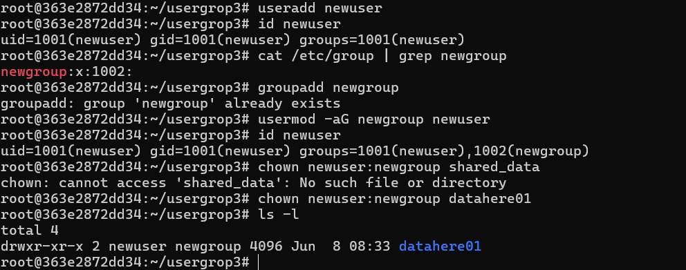
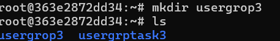
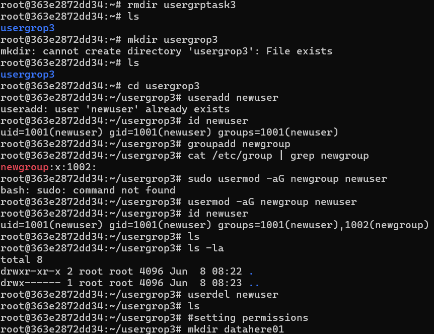

# task 4:- User and Group Management in Linux

1.Create a New User

useradd newuser

## adding new user

2. Create a New Group

## creating new group.

3. Add User to Group
## adding user to group. 

4. Delete a User
## deleting user. 
